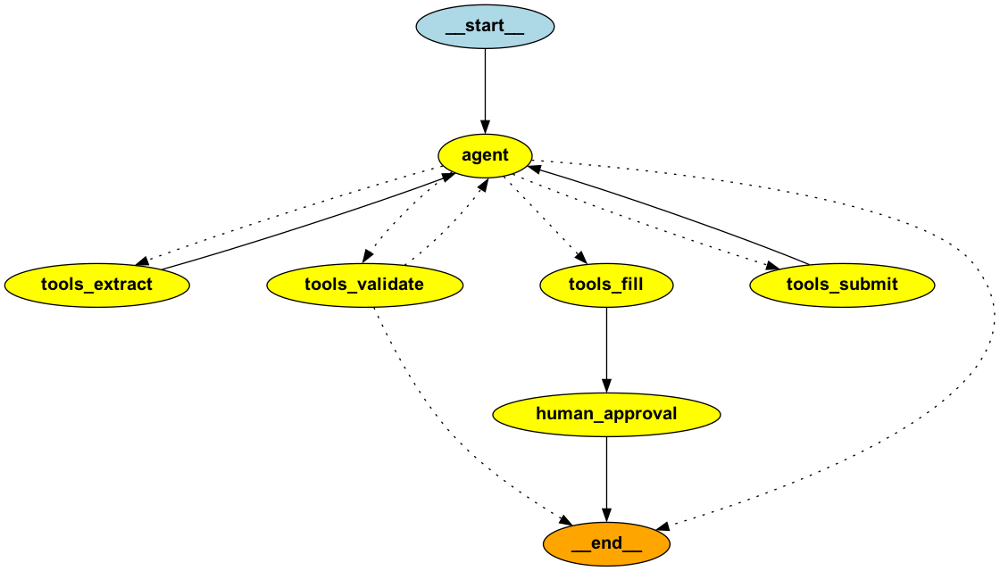

# make env

## with uv
```sh
cd fill_form_agent
uv venv --python 3.11
source .venv/bin/activate
uv pip install -r requirements.txt
```

## with conda
```sh
conda create -n agent_fill_online_form python=3.11
conda activate agent_fill_online_form
pip install -r requirements.txt
```


# Run
Make sure you have set your OpenAi API key: `export OPENAI_API_KEY=xxxxx`

```sh
uvicorn api:app --reload --port 8000
```

Then open http://localhost:8000


# Notes
I have set `HEADLESS = "false"` in the `api.py` to open a new chrome window.


# Details

## extract info
The inormation from the images and pdf will be extracted using the
```sh
python extrcat_info.py --input_file Example_G-28.pdf
python extrcat_info.py --input_file passport.jpg

```

## main Agent
you can run
```sh
python main.py --url https://mendrika-alma.github.io/form-submission/ --user_info data_example/user_info4.txt --headless false
```
to just see how the main code works.


It uses `langgraph` and
1. extract all the elements from the url (extracts label, type, is_requires, is_visible, ...)
2. calls the LLM to fill all the info given by the user (text, image, pdp, ...)
3. checks if all the required filds are filled
4. waits for the user approval before submitting the form.
5. summit the form

here is the graph:



